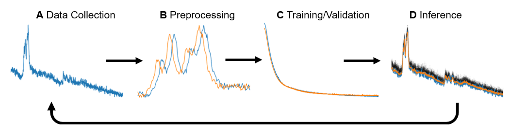
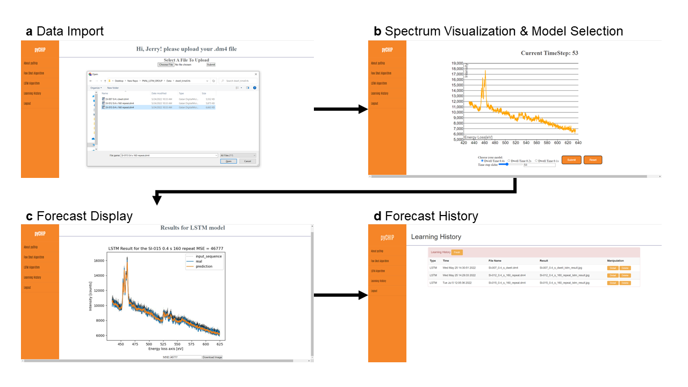

EELSTM: Forecasting of In Situ Electron Energy Loss Spectroscopy Data
=====

Program Overview
----
Forecasting models are a central part of many control systems, where high consequence decisions must be made on long latency control variables. EELSTM is an implementation of a long short-term memory model (LSTM) for forecasting of electron energy loss spectroscopy (EELS) data, one of the richest analytical probes of materials and chemical systems. Specifically, the model incorporates specific considerations for data collection, preprocessing, training, validation, and benchmarking. This model has excellent predictive power and may serve as a basis for future model-predictive control approaches in emerging autonomous microscope platforms.

This code is the result of a project for the University of Washington Industry Capstone program. For more information on the program, visit: https://www.engr.washington.edu/industry/capstone

How to Use EELSTM
=====

The EELSTM model workflow encompasses four steps: Data Collection, Preprocessing, Training and Validation, and Inference, as described in our associated manuscript and shown in the figure below. In Step 1, a user must determine experimental setup and EELS data acquisition, including considerations for the best model performance. In Step 2, the user applies preprocessing strategies unique to EELS data, resulting from the data collection process, variability between experiments, and the nature of core loss data itself. In Step 3, the model is trained and validated, considering the relationship between training inputs and predictions, model transferability, and temporal correlations. In Step 4, possible error metrics are applied to benchmark performance relative to ground truth experimental data. There are a number of considerations to ensure you get the best results using this model, as described in our manuscript linked below.

Requirements
---

You need to either download our GUI project or jupyter notebook under `working notebook` path to use our production. Please follow the installation steps.

Installation
---

For user familiar with the command line:

### Download Git Repository

1. `cd <replace with location of project folder>`
2. `git clone https://github.com/Yjin232/PNNL_LSTM_GROUP.git`
3. `cd GUI`

### Create Environment

For Mac users:
1. `python3 -m venv env`
2. `source env/bin/activate`

For Windows users:
1. `virtualenv env`
2. `\path\to\env\Scripts\activate`

For Pycharm users:
1. Open the project under the `GUI` root
2. Click the `install the requirements.txt` button

### Install Required Packages
Make sure your device could run the `PyTroch` and `Keras`
1. `cd GUI`
2. `pip install -r requirements.txt`

### Relaunch

To reactivate environment:
1. `source env/bin/activate` #if using mac
2. `\path\to\env\Scripts\activate` #if using windows
3. `cd to GUI folder`
4. `python app.py`

- For ease of use a demo video has been included in the repository under `GUI Demo`

## Graphical User Interface

Our graphical user interface (GUI) is based on Flask version == 2.0.1 and we integrated the EELSTM model functionality, in addition to interfacing with our existing few-shot machine learning code pyChip (https://github.com/pnnl/pychip_gui).

An overview image of the interface is shown below, encompassing four steps:

* Data Import: The GUI only accepts STEM spectrum data in *.dm4 format; the data file should contain a singal part and raw data time series.

* Spectrum Visualization & Model Selection: The GUI can then visualize the spectrum in time series and control sampling via a dynamic slider. In this page, the user should choose the dwell and other model parameters.

* Forecast Display: The GUI then provides the final prediction graph which includes the forecast, input sequences, ground truth data (if available), and mean squared error (MSE).

* Forecast History: The GUI also provides a learing history page to keep the track of the results of predictio. The user can select the `detail` button to download the results and `delete` button to delete the results.

## Data

The data used in our study is availble on Figshare at: https://doi.org/10.6084/m9.figshare.20288730.v1

How to Cite
======

If you would like to use this code, we request that you please cite our Arxiv preprint: X

To learn more about the application of few-shot ML to electron microscopy data, please consult our following publications:

 • Doty, C., Gallagher, S., Cui, W., Chen, W., Bhushan, S., Oostrom, M., Akers, S., & Spurgeon, S. R. (2022). Design of a Graphical User Interface for Few-Shot Machine Learning Classification of Electron Microscopy Data. Computational Materials Science, 203, 111121. [https://doi.org/10.1016/j.commatsci.2021.111121]
 
 • Akers, S., Kautz, E., Trevino-Gavito, A., Olszta, M., Matthews, B. E., Wang, L., Du, Y., & Spurgeon, S. R. (2021). Rapid and flexible segmentation of electron microscopy data using few-shot machine learning. npj Computational Materials, 7(1), 187. [https://doi.org/10.1038/s41524-021-00652-z]

Contact Information
 ======================

 For questions, contact Steven Spurgeon (steven.spurgeon@pnnl.gov).

 Team Members
-------------

 University of Washington Industry Capstone Program Students: Nicholas Lewis, Yicheng Jin, Xiuyu Tang, Vidit Shah

 Pacific Northwest National Laboratory: Christina Doty, Sarah Akers, and Steven R. Spurgeon

Acknowledgments
======================

The authors would like to thank Dr. Jenna (Bilbrey) Pope for reviewing the model and associated manuscript. C.D., B.E.M., S.A., and S.R.S. were supported by the Chemical Dynamics Initiative/Investment, under the Laboratory Directed Research and Development (LDRD) Program at Pacific Northwest National Laboratory (PNNL). PNNL is a multi-program national laboratory operated for the U.S. Department of Energy (DOE) by Battelle Memorial Institute under Contract No. DE-AC05-76RL01830. Experimental sample preparation was performed at the Environmental Molecular Sciences Laboratory (EMSL), a national scientific user facility sponsored by the Department of Energy's Office of Biological and Environmental Research and located at PNNL. EELS data was collected in the Radiological Microscopy Suite (RMS), located in the Radiochemical Processing Laboratory (RPL) at PNNL. N.L., Y.J., X.T., and V.S. were supported by the Data Intensive Research Enabling Clean Technology (DIRECT) National Science Foundation (NSF) National Research Traineeship (DGE-1633216), the State of Washington through the University of Washington (UW) Clean Energy Institute and the UW eScience Institute.

Usage License
===

Copyright 2022 Battelle Memorial Institute

Redistribution and use in source and binary forms, with or without
modification, are permitted provided that the following conditions are met:

1. Redistributions of source code must retain the above copyright notice, this
list of conditions and the following disclaimer.

2. Redistributions in binary form must reproduce the above copyright notice,
this list of conditions and the following disclaimer in the documentation
and/or other materials provided with the distribution.

THIS SOFTWARE IS PROVIDED BY THE COPYRIGHT HOLDERS AND CONTRIBUTORS "AS IS" AND
ANY EXPRESS OR IMPLIED WARRANTIES, INCLUDING, BUT NOT LIMITED TO, THE IMPLIED
WARRANTIES OF MERCHANTABILITY AND FITNESS FOR A PARTICULAR PURPOSE ARE
DISCLAIMED. IN NO EVENT SHALL THE COPYRIGHT HOLDER OR CONTRIBUTORS BE LIABLE
FOR ANY DIRECT, INDIRECT, INCIDENTAL, SPECIAL, EXEMPLARY, OR CONSEQUENTIAL
DAMAGES (INCLUDING, BUT NOT LIMITED TO, PROCUREMENT OF SUBSTITUTE GOODS OR
SERVICES; LOSS OF USE, DATA, OR PROFITS; OR BUSINESS INTERRUPTION) HOWEVER
CAUSED AND ON ANY THEORY OF LIABILITY, WHETHER IN CONTRACT, STRICT LIABILITY,
OR TORT (INCLUDING NEGLIGENCE OR OTHERWISE) ARISING IN ANY WAY OUT OF THE USE
OF THIS SOFTWARE, EVEN IF ADVISED OF THE POSSIBILITY OF SUCH DAMAGE.

Disclaimer
======================
This material was prepared as an account of work sponsored by an agency of the United States Government.  Neither the United States Government nor the United States Department of Energy, nor Battelle, nor any of their employees, nor any jurisdiction or organization that has cooperated in the development of these materials, makes any warranty, express or implied, or assumes any legal liability or responsibility for the accuracy, completeness, or usefulness or any information, apparatus, product, software, or process disclosed, or represents that its use would not infringe privately owned rights.
Reference herein to any specific commercial product, process, or service by trade name, trademark, manufacturer, or otherwise does not necessarily constitute or imply its endorsement, recommendation, or favoring by the United States Government or any agency thereof, or Battelle Memorial Institute. The views and opinions of authors expressed herein do not necessarily state or reflect those of the United States Government or any agency thereof.

PACIFIC NORTHWEST NATIONAL LABORATORY  
<i>operated by</i> 
BATTELLE 
<i>for the</i> 
UNITED STATES DEPARTMENT OF ENERGY 
<i>under Contract DE-AC05-76RL01830</i>

